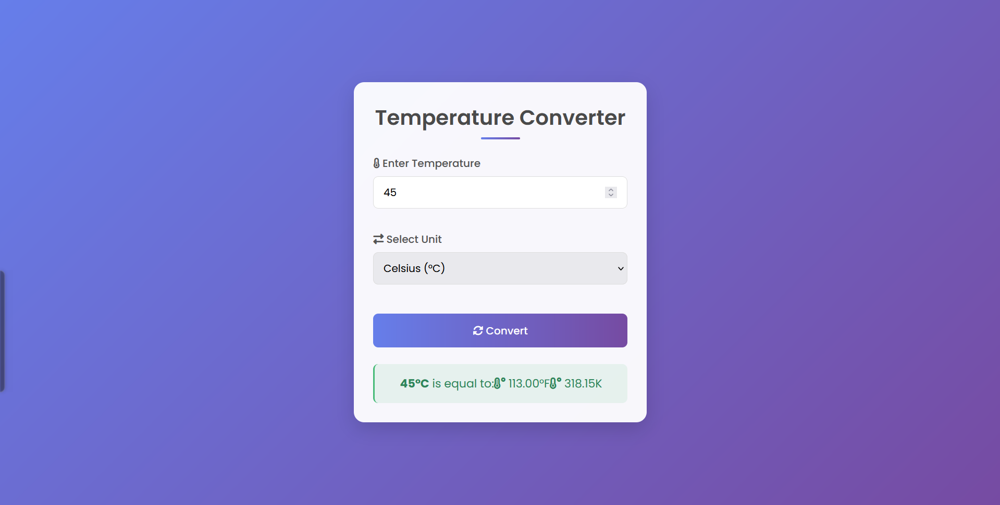

# Temperature Converter

A simple, responsive web application that converts temperatures between Celsius, Fahrenheit, and Kelvin units.

## Features

- Modern, clean user interface
- Converts between Celsius, Fahrenheit, and Kelvin
- Fully responsive design for all devices
- Real-time feedback with visual indicators

## Technologies Used

- HTML5
- CSS3
- JavaScript
- Font Awesome icons
- Google Fonts

## How to Use

1. Enter a temperature value
2. Select the unit (Celsius, Fahrenheit, or Kelvin)
3. Click "Convert" or press Enter
4. View the results

## Links

- [GitHub Repository](https://github.com/sainath-666/Temperature_Converter)
- [Live Demo](https://sainath-666.github.io/Temperature_Converter)

---

  
Made with ❤️ by Your Sainathreddy

